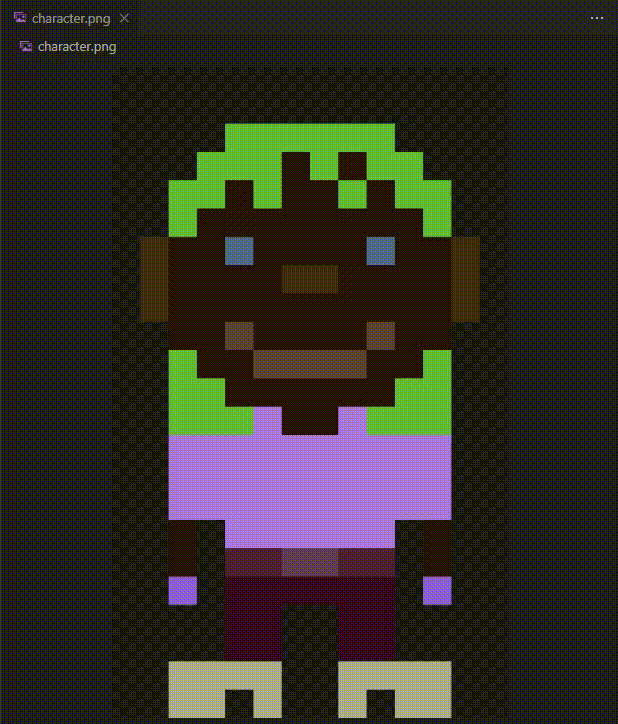

# PixelChar

PixelChar is a project that aims to create pixel art characters using code.

## Table of Contents
- [Introduction](#introduction)
- [Features](#features)
- [Installation](#installation)
- [Usage](#usage)
- [License](#license)

## Introduction

PixelChar is a fun and creative project that allows you to generate pixel art characters programmatically. Whether you're a game developer, an artist, or just someone who loves pixel art, PixelChar provides a simple and flexible way to create unique characters.

<p align="center" width="100%">
    
</p>

## Features

- Generate pixel art characters using code
- Customize character attributes
- Export characters as images for use in your projects

## Installation

To use PixelChar, you'll need to have [Python](https://www.python.org/) installed on your machine. Once you have Python installed, you can install PixelChar's requirements using pip:

```bash
pip install -r requirements.txt
```

## Usage

* Simply run:
    ```bash
    python create_character.py
* Character image will be outputed as `character.png`

---

# License

[PixelChar source code](https://github.com/ClownChu/PixelChar) is made available under the [GNU Affero General Public License v3.0 license](https://www.gnu.org/licenses/agpl-3.0.en.html) ([Read more](https://www.gnu.org/licenses/agpl-3.0.en.html))